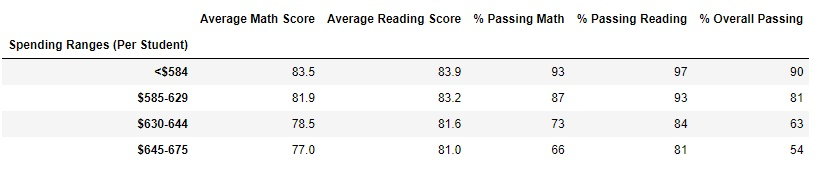

# School District Analysis

# Overview
The School board has identified academic dishonesty in the reading and math grades for Thomas High School (THS) 9th graders.  They have requested these grades be removed from the database and all subsequent analysis be adjusted.

# Objective
The reading and math scores for THS 9th graders need to be replaced with NaNs while keeping the rest of the data intact. Then, the school district data needs reanalyzing.

# Results

## The District Summary 

Without removing THS 9th graders math and reading scores, the averages scores for math, reading, and overall passing were as follows:

After removing the compromised 9th grade results, an increase was observed in % passing math, % passing reading, and % overall passing:

## The School Summary
Without removing THS 9th graders math and reading scores, the averages scores for math, reading, and overall passing were as follows:

After removing the compromised 9th grade results, an increase was observed in % passing math, % passing reading, and % overall passing:

## Thomas High School Relative Performance
How does replacing the ninth graders’ math and reading scores affect Thomas High School’s performance relative to the other schools?  A small, but insignicant change in school performance is observed with no effect on overall relative ranking.

Including the  THS 9th graders:

 
Excluding the THS 9th graders:

## Other Metrics

How does replacing the ninth-grade scores affect the following

Math and reading scores by grade

NaNs are listed in modified analysis:

 
    
###Scores by school spending

NaNs are listed in modified analysis:
 
    
###Scores by school size

No difference is observed in scores by school size after removing THS 9th grade data

Including THS 9th grade data:

Excluding THS 9th grade data:

    
###Scores by school type 

No difference is observed in scores by school git type after removing the THS 9th grade data

Including THS 9th grade data:
 

Excluding THS 9th grade data:
    

# Summary
Four changes in the updated school district analysis after reading and math scores for the ninth grade at Thomas High School have been replaced with NaNs:

- % passing math, % passing reading, & % passing overall by district increased
- % passing math, % passing reading, & % passing overall for THS decreased by => 0.5%.
- THS relative performance ranking by school did not change despite decrease in % passing math, % passing reading, & % passing overall
- No significant changes in scores by school type or size. 